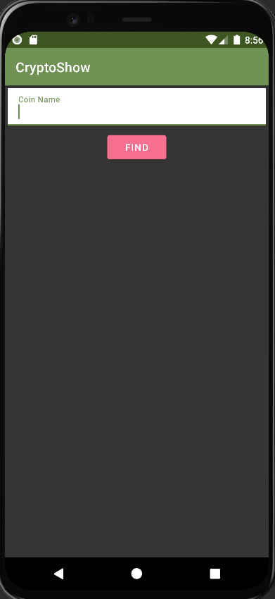
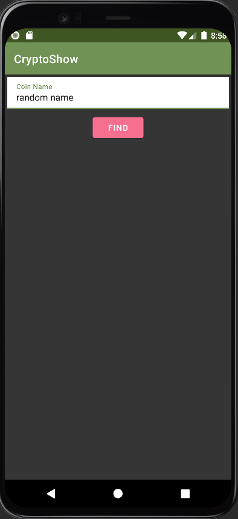
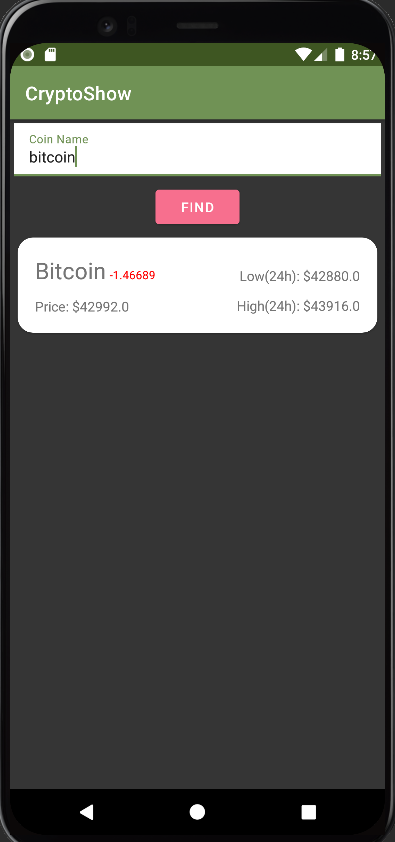

# CryptoShow

CryptoShow is a simple android application for viewing crypto currency prices using the [CoinGecko API](https://www.coingecko.com/en/api).

## Requirements

- Internet connection
- Android API Level >= 23 (Marshmallow)

## Screenshots

### Main screen

### Wrong search

### Checking the price of bitcoin

